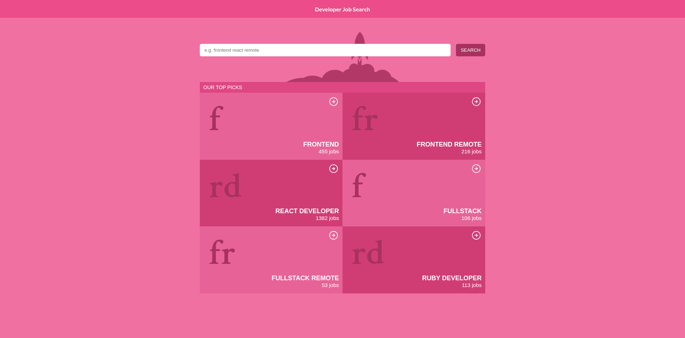

# Developer Job Search

> Developer Job Search is a React web app for searching for a job. This app is built using reed.co.uk job search API, the UK's #1 job site. Feel free to use my web app for browsing for jobs posted on the reed.co.uk website. The design is mobile responsive so you can use it on any device. However, take note that I am using limited hosting and my private proxy server, so bandwidth may be an issue. Please do let me know when you have this issue and I will respond accordingly.

./screenshot.png
> 

## Built With

- React
- Redux
- JavaScript (ES6+)
- [Reed job search API](https://www.reed.co.uk/developers)
- Jest
- React testing library

## Live Demo

:fire: https://wondrous-creponne-38ed9a.netlify.app/ :fire:

## Getting Started

To get a local copy up and running follow these simple steps:

### Prerequisites

- Node.js
- npm

### Setup

- Clone the project

- cd into the project directory

- Once you've cloned the repo and are inside the directory, run `npm install` command to get all necessary installations.

- **Yep, that's it!** you are now all set and simply run `npm start` to get your clone up and running on the browser.

## Author

👤 **Lusindiso Ntanjana**

- GitHub: [@Lusindiso](https://github.com/Lusindiso)
- Twitter: [@LusindisoNt](https://twitter.com/LusindisoNt)
- LinkedIn: [LinkedIn](https://www.linkedin.com/in/lusindisontanjana/)

## 🤝 Contributing

Contributions, issues, and feature requests are welcome!

Feel free to check the [issues page](../../issues/).

## Show your support

Give a ⭐️ if you like this project!

## Acknowledgments

- UI design idea by [Nelson Sakwa on Behance](https://www.behance.net/sakwadesignstudio)
- [Reed job search API](https://www.reed.co.uk/developers)
- CORS anywhere by [Rob Wu](https://github.com/Rob--W)

## 📝 License

This project is [MIT](./LICENSE) licensed.